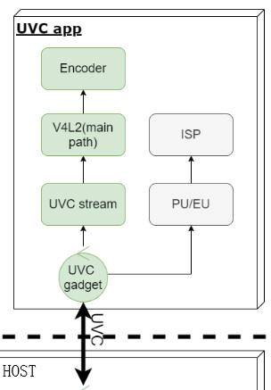

***
uvc_app介绍
===========

发布版本：1.0

作者邮箱：markhuang@rock-chips.com

日期：2020-04-15

文件密级：公开资料

Copyright 2020 @Fuzhou Rockchip Electronics Co., Ltd.

------

**前言**

**读者对象**

软件工程师，技术支持工程师

**修订记录**

|  **日期**  | **版本** | **作者** | 审核 | **修改说明** |
| :--------: | :------: | :------: | :--: | :----------- |
| 2020-04-15 |   v1.0   |  黄建财  | 陈伟 | 初始版本     |
|            |          |          |      |              |
|            |          |          |      |              |
|            |          |          |      |              |
|            |          |          |      |              |


------

[TOC]

---


简介
---

uvc_app实现了完整的uvc device的功能，包括配置、预览、切换、事件及指令响应等，通过采集摄像头的数据，通过MJPG编码或者H264编码通过ISOC模式传输。

使用方法
--------

- 使能uvc_app：make menuconfig，选择enable uvc_app或在buildroot对应产品defconfig中添加BR2_PACKAGE_UVC_APP=y
- 确认uvc_config.sh:确认usb设备配置，目前支持uvc和rndis复合。
- 执行uvc_config.sh，若需要使用复合设备如rndis，执行uvc_config.sh rndis
- 执行uvc_app默认将摄像头数据通过uvc传输

源码说明
--------

- 编译相关：/external/uvc_app/CMakeLists.txt、/buildroot/package/rockchip/uvc_app/Config.in  uvc_app.mk

- 入口：main.c

- usb脚本配置相关：uvc_config.sh

- process：camera初始化、PU处理、反初始化等处理
    * camera_control.cpp：camera线程处理实现
    * camera_pu_control.cpp：camera PU处理实现

- 热拔插事件：uevent.c， uevent.h

- uvc: uvc处理代码
    * 控制uvc，camera，编码线程的打开关闭：uvc_control.c，uvc_control.h
    * uvc编码传输处理：uvc_encode.cpp，uvc_encode.h
    * uvc主流程：uvc-gadget.c，uvc-gadget.h
    * uvc多节点操作，buffer管理：uvc_video.cpp，uvc_video.h
    * MJPG/H264编码：mpi_enc.c，mpi_enc.h
    * YUV格式转化：yuv.c，yuv.h

- drm内存操作：drm.c，drm.h

    

## 流程框图

### !1586916110999]


FAQ
---

###修改uvc的分辨率

- 应用补丁
    ```diff
    external/uvc_app$ git diff .
    diff --git a/uvc/uvc-gadget.c b/uvc/uvc-gadget.c
    index 6f71a0c..3eecf12 100755
    --- a/uvc/uvc-gadget.c
    +++ b/uvc/uvc-gadget.c
    @@ -172,6 +172,7 @@ static const struct uvc_frame_info uvc_frames_h264[] = {
         {  640, 480, { 333333, 400000, 500000, 666666, 1000000, 2000000, 0 }, },
     //    { 1280, 720, { 333333, 400000, 500000, 666666, 1000000, 2000000, 0 }, },
         { 1920, 1080, { 333333, 400000, 500000, 666666, 1000000, 2000000, 0 }, },
    +    { 3840, 2160, { 333333, 400000, 500000, 666666, 1000000, 2000000, 0 }, },
         { 0, 0, { 0, }, },
     };
     
    diff --git a/uvc_config.sh b/uvc_config.sh
    index 05dea30..6c21738 100755
    --- a/uvc_config.sh
    +++ b/uvc_config.sh
    @@ -95,6 +95,7 @@ mkdir /sys/kernel/config/usb_gadget/rockchip/functions/uvc.gs6/streaming/frameba
     configure_uvc_resolution_h264 640 480
     ##configure_uvc_resolution_h264 1280 720
     configure_uvc_resolution_h264 1920 1080
    +configure_uvc_resolution_h264 3840 2160
     
     
     mkdir /sys/kernel/config/usb_gadget/rockchip/functions/uvc.gs6/streaming/header/h
    ```
    


###修改 PC 端 Amcap 工具显示的名字

- 修改kernel/drivers/usb/gadget/function/f_uvc.c
    ```diff
    kernel$ git diff drivers/usb/gadget/function/f_uvc.c
    diff --git a/drivers/usb/gadget/function/f_uvc.c b/drivers/usb/gadget/function/f_uvc.c
    index 75e0000..fd0387f 100644
    --- a/drivers/usb/gadget/function/f_uvc.c
    +++ b/drivers/usb/gadget/function/f_uvc.c
    @@ -44,7 +44,7 @@ MODULE_PARM_DESC(trace, "Trace level bitmask");
     #define UVC_STRING_STREAMING_IDX               1
     
     static struct usb_string uvc_en_us_strings[] = {
    -       [UVC_STRING_CONTROL_IDX].s = "UVC Camera",
    +       [UVC_STRING_CONTROL_IDX].s = "UVC AICamera",
            [UVC_STRING_STREAMING_IDX].s = "Video Streaming",
            {  }
     };
    ```


### 修改 PU指令支持情况

- 修改kernel/drivers/usb/gadget/function/f_uvc.c，具体可视化可使用PC工具UsbTreeView.exe查看对应设备所有描述符信息。

  ```diff
  kernel$ git diff drivers/usb/gadget/function/f_uvc.c
  diff --git a/drivers/usb/gadget/function/f_uvc.c b/drivers/usb/gadget/function/f_uvc.c
  index 75e0000..fd0387f 100644
  --- a/drivers/usb/gadget/function/f_uvc.c
  +++ b/drivers/usb/gadget/function/f_uvc.c
  @@ -1037,8 +1037,8 @@ static struct usb_function_instance *uvc_alloc_inst(void)
          pd->bSourceID                   = 1;
          pd->wMaxMultiplier              = cpu_to_le16(16*1024);
          pd->bControlSize                = 2;
  -       pd->bmControls[0]               = 1;
  -       pd->bmControls[1]               = 0;
  +       pd->bmControls[0]               = 0x5b;
  +       pd->bmControls[1]               = 0x17;
          pd->iProcessing                 = 0;
   
          od = &opts->uvc_output_terminal;
  ```

修改后对应bmControls配置：

>         -------- Video Control Processing Unit Descriptor -----
> bLength                  : 0x0B (11 bytes)
> bDescriptorType          : 0x24 (Video Control Interface)
> bDescriptorSubtype       : 0x05 (Processing Unit)
> bUnitID                  : 0x02
> bSourceID                : 0x01
> wMaxMultiplier           : 0x4000 (163.84x Zoom)
> bControlSize             : 0x02
> **bmControls               : 0x5B, 0x17**
>  D00                     : 1  yes -  Brightness
>  D01                     : 1  yes -  Contrast
>  D02                     : 0   no -  Hue
>  D03                     : 1  yes -  Saturation
>  D04                     : 1  yes -  Sharpness
>  D05                     : 0   no -  Gamma
>  D06                     : 1  yes -  White Balance Temperature
>  D07                     : 0   no -  White Balance Component
>  D08                     : 1  yes -  Backlight Compensation
>  D09                     : 1  yes -  Gain
>  D10                     : 1  yes -  Power Line Frequency
>  D11                     : 0   no -  Hue, Auto
>  D12                     : 1  yes -  White Balance Temperature, Auto
>  D13                     : 0   no -  White Balance Component, Auto
>  D14                     : 0   no -  Digital Multiplier
>  D15                     : 0   no -  Digital Multiplier Limit
> iProcessing              : 0x00
> Data (HexDump)           : 0B 24 05 02 01 00 40 02 5B 17 00                  .$....@.[..


### 修改 device序列号

```diff
external/uvc_app$ git diff .
diff --git a/uvc_config.sh b/uvc_config.sh
index 05dea30..12207ce 100755
--- a/uvc_config.sh
+++ b/uvc_config.sh
@@ -58,7 +58,7 @@ echo 0x2207 > /sys/kernel/config/usb_gadget/rockchip/idVendor
 echo 0x0310 > /sys/kernel/config/usb_gadget/rockchip/bcdDevice
 echo 0x0200 > /sys/kernel/config/usb_gadget/rockchip/bcdUSB
 
-echo "2020" > /sys/kernel/config/usb_gadget/rockchip/strings/0x409/serialnumber
+echo "20201111" > /sys/kernel/config/usb_gadget/rockchip/strings/0x409/serialnumber
 echo "rockchip" > /sys/kernel/config/usb_gadget/rockchip/strings/0x409/manufacturer
 echo "UVC" > /sys/kernel/config/usb_gadget/rockchip/strings/0x409/product
```

### 

###关闭H264支持

```diff
external/uvc_app$ git diff .
diff --git a/uvc/uvc-gadget.c b/uvc/uvc-gadget.c
index 6f71a0c..29a1130 100755
--- a/uvc/uvc-gadget.c
+++ b/uvc/uvc-gadget.c
@@ -178,7 +178,7 @@ static const struct uvc_frame_info uvc_frames_h264[] = {
 static const struct uvc_format_info uvc_formats[] = {
 //    { V4L2_PIX_FMT_YUYV, uvc_frames_yuyv },
     { V4L2_PIX_FMT_MJPEG, uvc_frames_mjpeg },
-    { V4L2_PIX_FMT_H264, uvc_frames_h264 },
+//    { V4L2_PIX_FMT_H264, uvc_frames_h264 },
 };
 
 /* ---------------------------------------------------------------------------
diff --git a/uvc_config.sh b/uvc_config.sh
index 05dea30..4cc783c 100755
--- a/uvc_config.sh
+++ b/uvc_config.sh
@@ -91,16 +91,11 @@ configure_uvc_resolution_mjpeg 2560 1440
 configure_uvc_resolution_mjpeg 2592 1944
 
 ## h.264 support config
-mkdir /sys/kernel/config/usb_gadget/rockchip/functions/uvc.gs6/streaming/framebased/f
-configure_uvc_resolution_h264 640 480
-##configure_uvc_resolution_h264 1280 720
-configure_uvc_resolution_h264 1920 1080
 
 
 mkdir /sys/kernel/config/usb_gadget/rockchip/functions/uvc.gs6/streaming/header/h
 #ln -s /sys/kernel/config/usb_gadget/rockchip/functions/uvc.gs6/streaming/uncompressed/u /sys/kernel/config/usb_gadget/rockchip/functions/uvc.gs6/streaming/header/h/u
 ln -s /sys/kernel/config/usb_gadget/rockchip/functions/uvc.gs6/streaming/mjpeg/m /sys/kernel/config/usb_gadget/rockchip/functions/uvc.gs6/streaming/header/h/m
-ln -s /sys/kernel/config/usb_gadget/rockchip/functions/uvc.gs6/streaming/framebased/f /sys/kernel/config/usb_gadget/rockchip/functions/uvc.gs6/streaming/header/h/f
 ln -s /sys/kernel/config/usb_gadget/rockchip/functions/uvc.gs6/streaming/header/h /sys/kernel/config/usb_gadget/rockchip/functions/uvc.gs6/streaming/class/fs/h
 ln -s /sys/kernel/config/usb_gadget/rockchip/functions/uvc.gs6/streaming/header/h /sys/kernel/config/usb_gadget/rockchip/functions/uvc.gs6/streaming/class/hs/h
 ln -s /sys/kernel/config/usb_gadget/rockchip/functions/uvc.gs6/streaming/header/h /sys/kernel/config/usb_gadget/rockchip/functions/uvc.gs6/streaming/class/ss/h
```